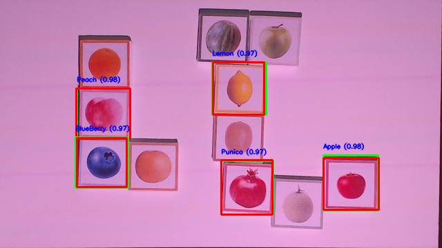
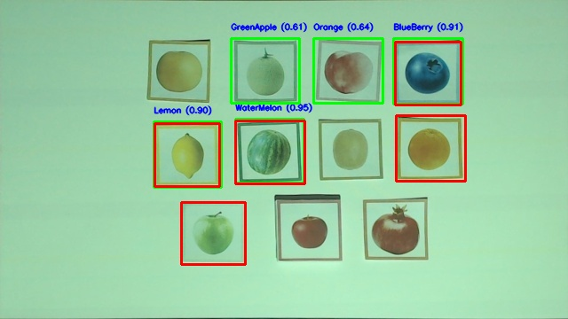
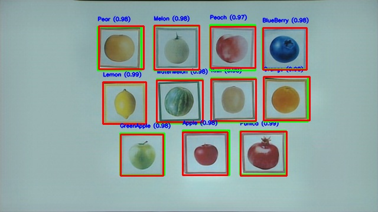

# GAN-based Image Restoration for Projector–Camera Systems

Research code for restoring projection-induced color distortions with a GAN and evaluating the downstream impact on object detection (Template Matching, YOLO). The restoration and detection stages are modular, so pre-trained detectors can be reused without retraining.

    

## Project Overview


*Projector-Camera system setup and the color distortion problem addressed by our GAN-based approach*

**Goal**: Restore images captured under projector illumination to their near-original appearance and verify that restoration improves object detection accuracy.

**Setting**: Projection–Camera (PC) systems where projector light alters perceived color/luminance distributions.

**Approach**: ROI warping (homography) → GAN restoration → evaluation with Template Matching and YOLO.

## Why It Matters

Projector color/brightness and ambient light often shift object color distributions. For classes with similar shapes but discriminative colors (e.g., fruits), detectors misclassify frequently. Instead of retraining detectors per lighting condition, this project normalizes the input first.

## Core Ideas


*Overall architecture of our proposed GAN restoration model with Color Conditioning and Similarity Map branch*

### **GAN Restorer**
- **Color Conditioning**: inject the projector's RGB illumination vector
- **Attention + Residual blocks**: preserve fine structure and color details
- **WGAN-GP + Perceptual loss**: stabilize training and enhance perceptual quality

### **Discriminator Aux Signal**
**Similarity Map branch**: explicitly models pixel-level correspondence between real/restored pairs to expose subtle artifacts

### **Object-centric Evaluation**
Compute LPIPS, CIEDE2000, PSNR, SSIM, Histogram Cosine Similarity, MSE on **object masks** (background excluded)


## 📊 Key Results (Summary)

### Quantitative (object regions)

| Metric | Value |
|--------|--------|
| LPIPS ↓ | **0.078** |
| CIEDE2000 ↓ | **5.766** |
| SSIM ↑ | **0.903** |
| PSNR ↑ | **26.58 dB** |
| Histogram Cosine Similarity ↑ | **0.744** |
| MSE ↓ | **386.7** |

*Consistently outperforms representative baselines: Autoencoder, SRCNN, U-Net, ResNet50, DnCNN*

### Detection transfer


*Detection accuracy comparison: Original images vs. Distorted images vs. Our restored images*

| Method | Average Accuracy |
|--------|------------------|
| **Template Matching** | **97.2%** |
| **YOLO** | **99.2%** |

→ *Nearly matches performance on undistorted originals*

## Detection Comparison

| Projection-distorted | GAN-restored |
|:--:|:--:|
|  |  |
|  |  |


## ⚠Scope & Limitations

- **Focused on monochromatic** (single-color) projection first
- Potential degradation under **spatially non-uniform backgrounds**, **highly reflective or high-chroma materials**, or **illumination RGB outside training coverage**
- For production **SAR/AR**, we recommend extending to **multi-color/dynamic lighting** and targeting **real-time/lightweight models**

## What's Included

- **GAN restoration pipeline** (generator, discriminator, losses, metrics)
- **Detection evaluation routines** (Template Matching, YOLO) and scripts to reproduce tables/figures
- **Reproducibility hooks** for sample data/weights (if full data cannot be released, provide samples + generation scripts)

## Repository Structure

<details open>
<summary><b>Directory Tree</b></summary>

```
├─ 1_GanModel/
│  ├─ GanModel.py                  # GAN model definitions (Generator/Discriminator, losses)
│  ├─ GanModel_exe.py              # Training/inference entry for GAN restoration
│  ├─ GanModel_outPut.py           # Saving/visualizing restoration outputs
│  └─ GanModel_PT/                 # Pretrained/final weights (.h5)
│      ├─ discriminator_epoch_50.h5
│      └─ generator_epoch_50.h5
├─ 2_ModelSet/
│  ├─ ModelSet.py                  # Baseline restorers (AE/SRCNN/U-Net/ResNet/DnCNN)
│  ├─ Model_exe.py                 # Baseline inference pipeline
│  └─ Model_OutPut.py              # Baseline output collation
├─ 3_Value/
│  ├─ CropImage_Evaluation_EXE.py  # Object-mask/crop-based quantitative evaluation
│  ├─ Image_Evaluation_EXE.py      # Full-image quantitative evaluation
│  ├─ Image_Evaluation_Funtion.py  # Metrics: PSNR/SSIM/LPIPS/CIEDE2000/HistCosSim/MSE
│  ├─ Template/
│  │  ├─ FruitImage_Real/          # Class templates for Template Matching
│  │  └─ TestDetecting_Rotation_evaluate_2.py  # Template Matching evaluation
│  └─ Yolo/
│      ├─ 08066best.pt             # YOLO weights (project "best")
│      ├─ TestDetecting_Yolo_evaluate_1.py      # YOLO evaluation script
│      └─ YoloDetection.py         # YOLO inference/post-processing utils
├─ ImageData/
│  ├─ Original_100/                # Sample originals
│  ├─ Yolo_Label_100/              # YOLO labels (boxes/classes)
│  └─ SampleI_mage/                # Sample/demo images
└─ FeatureDataCreate.py            # RGB condition vector & auxiliary feature creation
```

</details>

### Directory Roles (at a glance)

- **1_GanModel/** — core GAN restoration code + weights
- **2_ModelSet/** — comparable restoration baselines  
- **3_Value/** — quantitative metrics & detection evaluations (Template / YOLO)
- **ImageData/** — sample originals/labels/images (partial)
- **FeatureDataCreate.py** — utilities to build RGB condition vectors / features

<!--
## Citation

If you use this code, please cite the corresponding paper:

```bibtex
@article{Lee2025ProjectorGAN,
  title   = {GAN-Based Image Restoration for Enhancing Object Detection in Projector-Camera Systems},
  author  = {Lee, Jeong Hyeon and Kim, Meejin and Lee, Sukwon and Kang, Changgu},
  journal = {IEEE Access},
  year    = {2025},
  doi     = {10.1109/ACCESS.2017.DOI}
}

-->

## License & Contact

- **License**: MIT License (see LICENSE file)
- **Contact**: Issues tab or [maintainer@email.com](mailto:maintainer@email.com)

---

> **Note**: This README focuses on the project description. Installation/running instructions, data/weights links, and reproducibility details can be added as separate sections when you're ready.
